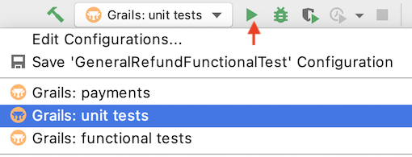

# ¿Cómo puedo continuar? #

## Configura tu ambiente ##

Nuestra **API Core de Pagos** está desarrollada en Grails y podemos clonarla e iniciarla localmente con el comando
~~~
fury get openplatform-payments-api
~~~

Y podrás crear tu rama con los comandos básicos de git, por ejemplo:

~~~
git checkout -b feature/nombre_de_la_rama
~~~

Al abrir el proyecto en el IDE debemos asegurarnos de tener el enlace a las versiones correctas de Grails (2.5.3) y el SDK de java (1.8)

## Ejecuta pruebas ##
Si tu configuración es correcta, en este punto podrás correr localmalmente los tests unitarios y funcionales de la API; para esto lo primero será levantar los servicios memcached, redis (por consola) y mockserver (por consola, dentro de la carpeta del proyecto). Comandos:

~~~
memcached -d | redis-server | cd mockserver_desa && node .
~~~

### Unitarias ###
~~~
grails test-app unit: -echoOut -Dgrails.full.stacktrace=true
~~~

### Funcionales ###
~~~
grails test-app :functional
~~~

**En ambos casos se puede configurar el IDE para guardar etos comandos y ejecutar los tests en un click:** Run/Debug Configurations -> Add New Configuration (+)

## Crea un pago y un refund ##

### Deploy ###

Para hacer un deploy en ambiente de pruebas es necesario preparar una **versión** a través de un comando de fury:
~~~
fury create-version <version> 
-o-
fury create-version <version> --no-tests
~~~

Necesitarás también apartar un **Scope** de los disponibles para pruebas. Puedes buscar 'Yoink' entre las aplicaciones de Slack y listar los recursos disponibles:
~~~
resources list
~~~
Y seleccionar para ti alguno de los scopes *'pay-core-'* no bloqueados:
~~~
/yoink [resource] [message] [expiry]
~~~

Una vez cumplidos estos pasos, está todo listo para hacer [tu primer deploy.](https://furydocs.io/docs/2.0.64/guide/#/lang-es/fury/deploy)

#### Generar Token ####
Antes de lanzar la creación de un pago o un refund, es necesario que obtengas un token a través del comando:

~~~
fury get-token
~~~

Esto servirá para actualizar el header **X-Auth-Token** presente en los curls que verás a continuación.

### Creación del Pago ###

Curl de ejemplo:

~~~
curl --request POST \
  --url 'https://theta_openplatform-payments-api.furyapps.io/payments?caller.id=216803979&client.id=3789690169334260&caller.admin=false' \
  --header 'Content-Type: application/json' \
  --header 'X-Auth-Token: 2f24b59c54ee353ffb3938be3cc0e82f91525eceffab3eac49d13e6de0e18b0b' \
  --header 'X-Caller-Scopes: payments,custom_fee,admin' \
  --data '{"payment_method_id": "account_money", 
 "transaction_amount": 100, 
 "collector": {
	     "id": 514505567}, 
 "marketplace": "MELI"
}'
~~~

En donde:
- **payment_method_id** es el ID del método de pago, en este caso, una cuenta.
- **transaction_amount** es el monto del pago.
- **collector-id**
- **marketplace**

Es importante modificar en la URL el nombre del scope ('theta' se sustituye por el scope escogido anteriormente). También puedes modificar los parámetros *caller.id* y *client.id*. **Esto aplica para todos los curls vistos en esta guía.**

### Creación del Refund ###

Curl de ejemplo para aplicar un refund:

~~~
curl --request POST \
  --url 'https://theta_openplatform-payments-api.furyapps.io/payments/16867391001/refunds?caller.id=216803979&client.id=3789690169334260&caller.admin=false' \
  --header 'Content-Type: application/json' \
  --header 'X-auth-token: 2f24b59c54ee353ffb3938be3cc0e82f91525eceffab3eac49d13e6de0e18b0b' \
  --header 'X-caller-scopes: payments,admin' \
  --data '{
    "amount": 100
}'
~~~

Existen varios tipos de refund; si deseas hacer un **refund parcial**, el *"amount"* enviado en este curl debe ser menor al total del *"transaction_amount"* enviado en el pago. Si el monto es igual, se entenderá que el refund realizado es **total**.

**Para verificar el pago, el refund y otros movimientos, ingresa el *id del pago* ("id" obtenido en la respuesta del primer POST)** [acá](https://payments.adminml.com/payment/)